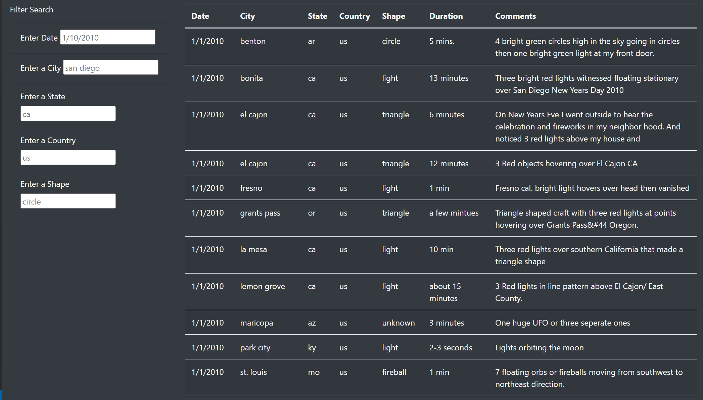
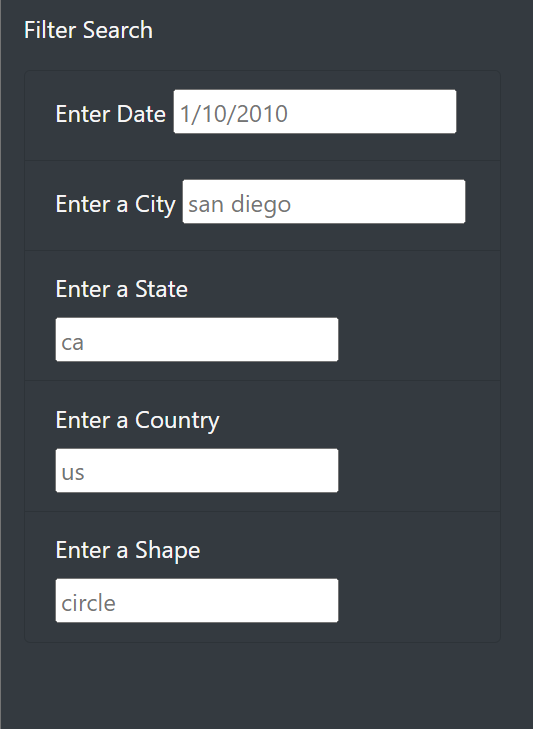
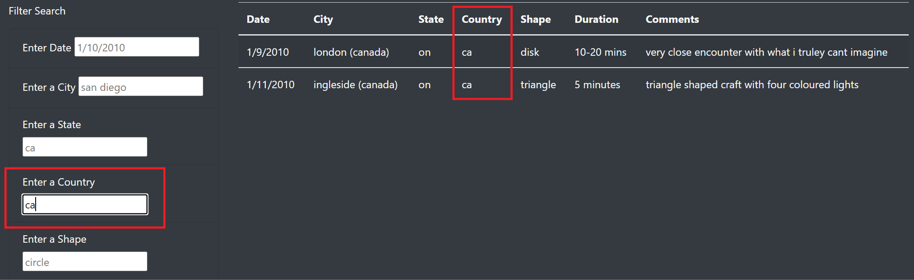
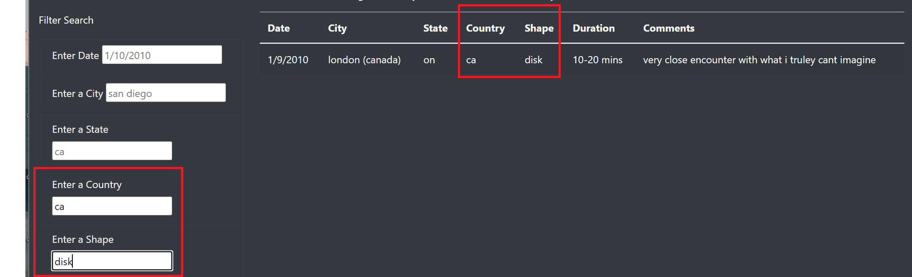
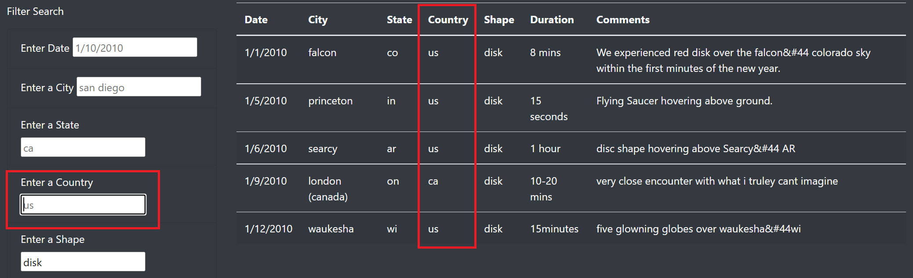

# UFO

## Overview

The purpose of this analysis is to create a user-friendly and responsive visualisation of data using HTML, Javascript, and CSS. The data used in this project is about UFO observations, and it is displayed on a webpage with a dynamic table that can be filtered by date, country, state, city, and shape.

## Results

- Webpage Layout

- By default, the table shows all available data. That is the visualisation when first open [index.html](index.html).

- Users can fill any of the available filters, or combine multiple filters to create a criteria.

- In this example, data was filtered by country. In the field "Enter a Country" was typed "ca" for Canada.

- Then, "disk" was entered in the field "Enter a Shape".

- To remove a filter, just delete the text in the field. In the example, the country criteria was removed, resulting in all occurrences of disk observations in Canada and in the US.

## Summary

The new webpage design offers a set of filters that allow users to search for more relevant information. However, each filter is based on user inputs, without any error treatment. As a result, if a user enters some value that does not match the data. For example, wrong date format, a city that did not register any UFO occurrences, and so on. Also, the text in gray inside each filter might be confused with a real value. Still, a placeholder is necessary to inform the right format expected for each field.

A few changes should improve the user experience:
- Create drop-down lists, showing only valid values for country, state, and shape.
- Change the date input to be based on a calendar, which would solve any formatting issue.
- When data does not match the filter criteria, show a message to inform the user to try new parameters.